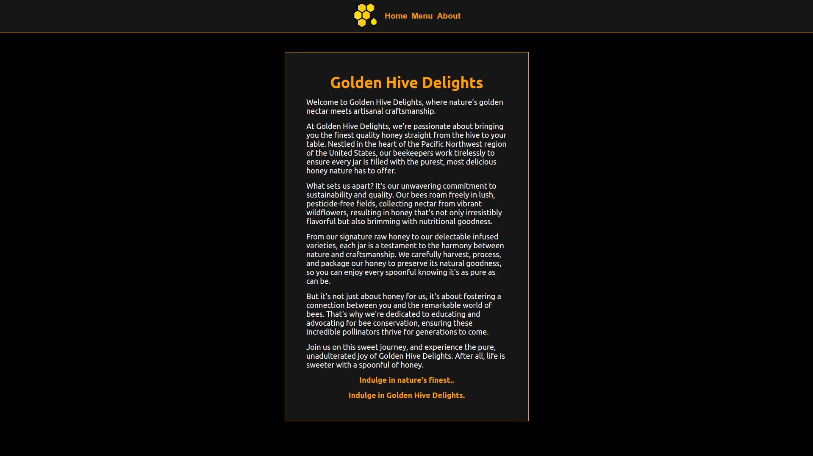

# restaurant-page

## Preview

## Description
* A simple Restaurant browser page.

## Made with
* HTML, CSS and JavaScript.

## Visit website
* [Link](https://jovan-nsty.github.io/restaurant-page/)

## Purpose
* The purpose of this project was to make a dynamically rendered website homepage using Webpack and JavaScript ES6 Modules.

* This project was done following The Odin Project curriculum.